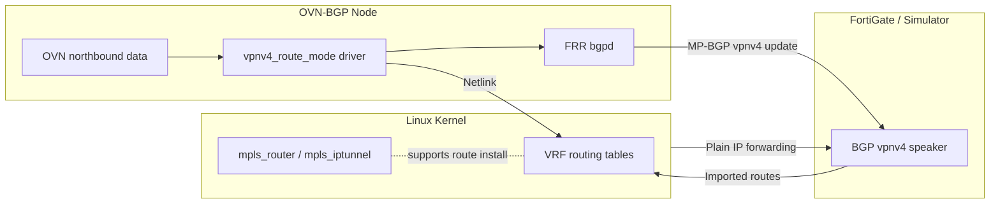

OVN-BGP → FortiGate VPNv4 Experiment
====================================

## Status Snapshot (2025-11-05)

- ✅ **Control plane proven in lab:** `make lab-up && make vpnv4-apply` brings up a kind + OVN-Kubernetes cluster where FRR advertises multiple VRFs (`demo`, `demo-b`) via MP-BGP VPNv4.
- ✅ **Kernel routes installed:** `scripts/vpnv4/setup_vrfs.py` creates the Linux VRF devices and blackhole routes so the prefixes persist in `ip route show vrf <name>`.
- ✅ **FortiGate simulator acceptance:** GoBGP imports both RDs/RTs and exposes them via `gobgp vrf demo{,-b} rib` and the global VPNv4 table.
- ✅ **Agent integration scaffolded:** `src/ovn_bgp_agent/` hosts a lightweight driver registry and vpnv4 adapter mirroring the upstream `ovn-bgp-agent` contract.
- ✅ **Automated lab validation:** `scripts/lab/validate_vpnv4.py` runs at the end of `lab-up` to assert FRR/GoBGP session state and VRF routes.
- ✅ **Standalone agent container:** `vpnv4-agent` binary + `images/agent/Dockerfile` build a GHCR-ready image driven by a YAML config with file or OVN-NB watchers.
- ✅ **OVN watcher integration:** Agent successfully polls OVN NB DB and generates VPNv4 configs in real-time as namespaces/pods are created.
- ✅ **VRF name sanitization:** Namespace names are automatically sanitized to Linux-safe VRF device names (e.g., `kube-system` → `vrf34816`).
- ✅ **Production cluster documentation:** Deployment guides for k3s and OpenShift clusters with kernel module requirements.
- 🚧 **Upstream integration analysis:** Created skeleton driver (`upstream_vpnv4_driver.py`) and documented integration requirements. The upstream `ovn-bgp-agent` uses a different API (IP-oriented vs our namespace-oriented), requiring further investigation into namespace context extraction.
- ✅ **Standalone agent ready:** The `vpnv4-agent` can be deployed independently and works end-to-end. This is the recommended approach for production testing.
- 🚧 **Production cluster testing pending:** Validation on real k3s/OCP clusters before upstream PR submission.

Tag the repo (e.g. `git tag poc-vpnv4-lab`) after a successful `lab-up` run to share the current proof-of-concept snapshot.

## 1. Problem & Goals

- `ovn-bgp-agent` currently exports tenant prefixes as EVPN type-5 routes (AFI/SAFI 25/70).
- FortiGate firewalls do not import EVPN type-5 for L3 forwarding; they expect VPNv4/VPNv6 (AFI/SAFI 1/128, 2/128) with MPLS semantics.
- **Goal:** prototype a new `ovn-bgp-agent` routing mode that advertises per-tenant VRF prefixes via MP-BGP VPNv4/6 so FortiGate can participate in route exchange.
- **Stretch Goal:** keep the data plane IP-only (no MPLS switching) while preserving multi-tenancy via RD/RT.

### Non-Goals

- Delivering production-grade MPLS forwarding.
- Full FortiGate feature parity (e.g., L2 EVPN bridging).
- Implementing comprehensive FortiGate automation; focus stays on control-plane interoperability.

## 2. Proposed Architecture (Lite MPLS Control Plane)

```
+----------------------+      +---------------------+
| OVN-BGP Agent Node  |      | FortiGate (PE role) |
|----------------------|      |---------------------|
| - VRF per namespace  |      | - VDOM/VRF per RT   |
| - RD/RT allocator    |<====>| - VPNv4/6 AF        |
| - FRR vpnv4 family   | MP-BGP | - RT import/export |
| - Dummy MPLS labels  |      | - IP forwarding     |
+----------------------+      +---------------------+
```

### 2.1 High-Level Flow (Mermaid)



- Advertise prefixes through MP-BGP VPNv4/6 AFI-SAFI.
- Assign RD/RT per OVN project/namespace.
- Reuse existing FRR integration in `ovn-bgp-agent`; extend it with a `vpnv4_route_mode` driver.
- Treat MPLS labels as implicit-null/dummy until a full MPLS core is required.

## 3. Implementation Roadmap

1. ✅ **Design Finalization** – deterministic RD/RT allocation defined via `DeterministicAllocator`.
2. ✅ **Driver Skeleton** – experimental package under `src/ovn_bgp_vpnv4/` renders FRR vpnv4 stanzas and tracks tenant prefixes.
3. ✅ **Control-Plane Logic (lab)** – FRR vpnv4 config renders per-VRF blocks, `no bgp network import-check`, and lab script installs supporting blackhole routes.
4. ✅ **OVN Integration** – OVN NB DB watcher polls and discovers namespaces/pods in real-time.
5. ✅ **Production Deployment Guides** – k3s and OpenShift deployment documentation with kernel module requirements.
6. 🚧 **Production Cluster Testing** – validate on real k3s/OCP clusters before upstream PR.
7. 🚧 **CLI / CRD Integration** – wire the driver into upstream `ovn-bgp-agent` feature flags and config surfaces.
8. 🚧 **Testing & Tooling (CI)** – promote lab workflow into automated pipelines once upstream integration lands.
9. 🚧 **Documentation & Demos** – record FortiGate simulator demo + publish upstream install/runbook.

> Items 1-5 are proven in the current repository snapshot. Item 6 (production cluster testing) should be completed before upstream integration. Remaining tasks focus on upstreaming and productizing.

## 4. Development & POC Environment

### 4.1 Host Requirements

- Linux host (5.15+ kernel, tested on Ubuntu 22.04+).
- Docker / podman for containerized FRR and simulators.
- Python 3.10+ (if contributing to `ovn-bgp-agent` Python codebase).
- Go 1.21+ (if FortiGate simulator is implemented with GoBGP).

### 4.2 Core Components

- **OVN/OVN-BGP stack:** either a local cluster (kind + ovn-kubernetes) or access to existing lab cluster.
- **FRR container:** acts as the BGP process for `ovn-bgp-agent`.
- **FortiGate simulator:** lightweight MP-BGP speaker that enforces VPNv4 semantics.
  - Option A: `gobgp` with vpnv4 AFI/SAFI enabled and strict capability filtering.
  - Option B: Custom python-based mp-bgp harness using `scapy`/`ExaBGP` for fine-grained control.
- **Automation harness:** scripts (Makefile or Ansible) to bootstrap the lab, configure FRR, and launch simulations.

### 4.3 Networking Assumptions

- Control-plane BGP sessions run over IP (no MPLS transport network required).
- VRFs on the OVN side map to Linux network namespaces or FRR VRFs.
- Load kernel modules `mpls_router` and `mpls_iptunnel` (required for VPNv4 route installation even without MPLS forwarding).
- Keep `net.mpls.platform_labels=0` initially; revisit if label switching becomes necessary.

### 4.4 Topology Blueprint

- `kind` cluster (or equivalent) running OVN-Kubernetes + `ovn-bgp-agent`.
- Dedicated FRR container per worker node; FRR peers with FortiGate simulator over a routed /30 link.
- Management network for automation host (Ansible/Make) with SSH access to all nodes/containers.
- Optional packet-capture host (tcpdump/wireshark) on the BGP peering segment for protocol validation.

### 4.5 Tooling Stack & Scripts

- `docker-compose.yaml` (or Tilt) describing FRR + simulator containers with exported volumes for configs.
- `scripts/lab/` helpers:
  - `lab-up.sh`: bootstrap kind cluster, deploy OVN, start FRR + simulator.
  - `lab-down.sh`: tear down containers and cluster resources.
  - `push-config.sh`: regenerate FRR config snippets from templates.
- `scripts/vpnv4/render.py`: renders vpnv4 FRR configuration from
  `deploy/vpnv4/tenants.json` using the driver skeleton.
- `src/ovn_bgp_vpnv4/`: experimental vpnv4 driver package with deterministic RD/RT
  allocator and FRR rendering utilities.
- `pyproject.toml`: Python project definition; run `pip install -e .[dev]` to get
  pytest and the driver on your path.
- `pytest -q`: executes unit tests that cover allocator, renderer and driver skeleton.
- `tests/` directory hosting pytest or Go test harnesses that drive simulator assertions via REST/gRPC.
- `docs/` diagrams and reference configs (FRR, FortiGate CLI, simulator policies).

### 4.6 Kernel Module Strategy & Fallbacks

- **Load requirements:** `modprobe mpls_router mpls_iptunnel` prior to advertising VPNv4 routes so the kernel accepts MPLS-labeled nexthops (even if dataplane remains IP-only).
- **Verification:**
  - `lsmod | grep mpls` should list both modules.
  - `sysctl net.mpls.platform_labels` can remain `0`; adjust only when enabling label switching tests.
- **Fallback path:** on hosts lacking MPLS modules, mark the affected tests as skipped and constrain experiments to control-plane validation only.
- **Containerized runners:** ensure CI nodes expose `/lib/modules` and allow `CAP_SYS_MODULE` or pre-load modules at boot.

## 5. Testing & Validation Strategy

### 5.1 Unit & Component Tests

- RD/RT allocator logic (deterministic IDs, collision handling).
- FRR configuration rendering (golden-file tests of generated `frr.conf`).
- MPLS label assignment defaults (even if dummy) to ensure RFC-compliant attributes.

### 5.2 Integration Tests

- Use docker-compose to spin up:
  - Containerized FRR (`frrouting/frr`).
  - FortiGate simulator (GoBGP or ExaBGP).
  - Minimal OVN-BGP driver process.
- Validate:
  - BGP OPEN negotiation includes vpnv4 capability.
  - FortiGate simulator receives prefixes with expected RD/RT.
  - Route import/export policies produce correct routing tables.

### 5.3 System / POC Tests

- **Kind-based lab:** deploy ovn-kubernetes + ovn-bgp-agent in VPNv4 mode; connect to simulator.
- **Failover scenarios:** bounce sessions, rotate RTs, ensure convergence does not regress.
- **Return path validation:** ensure imported routes install into OVN for pod egress.

### 5.4 Observability

- Collect FRR `show bgp vpnv4` outputs.
- Capture pcaps of BGP sessions to assert attribute correctness.
- Expose Prometheus metrics (existing ovn-bgp metrics + new vpnv4 counters).

### 5.5 Acceptance / Field Testing (Future)

- Pair with an actual FortiGate (lab license) once simulator passes.
- Enable MPLS dataplane if FortiGate requires explicit label operations for forwarding.

### 5.6 Test Matrix & Success Criteria

| Tier | Focus | What We Prove | Success Signals |
|------|-------|---------------|-----------------|
| Unit | RD/RT allocator, config rendering | Deterministic identifiers, no malformed FRR templates | CI unit job passes; golden files unchanged |
| Component | VPNv4 driver ↔ FRR | Driver emits expected CLI; FRR loads without warnings | `show bgp vpnv4` reflects injected prefixes |
| Integration | FRR ↔ simulator | MP-BGP negotiation, RT import/export | Simulator API reports routes with proper RD/RT and next-hop |
| System | Full lab with OVN pods | End-to-end pod route advertisement and import back into OVN | Pods in tenant VRF reach simulated WAN prefix |
| Field | Hardware FortiGate | Real device interoperability | FortiGate routing table shows prefixes; ping loopback works |

## 6. Development Workflow & Automation

1. `make deps`
   - Install required binaries (kind, kubectl, helm, gobgp).
2. `make lab-up`
   - Create kind cluster, deploy OVN/OVN-BGP manifests, start FRR + simulator containers.
   - Apply generated FRR configs under `deploy/frr/`.
3. `make test`
   - Run unit/component tests locally (pytest/go test) and integration suite against active lab.
4. `make observe`
   - Collect FRR + simulator diagnostics (`show bgp vpnv4`, route dumps) into `artifacts/` for analysis.
5. `make lab-down`
   - Destroy containers and clean kind cluster to keep host clean.

### 6.1 Driver Skeleton Demo

1. Ensure the lab is running (`make lab-up`).
2. Update `deploy/vpnv4/tenants.json` with the namespaces/prefixes you want to
   advertise (defaults to a single `demo` tenant exporting `10.244.0.0/24`).
3. Render and apply the FRR config:

   ```bash
   make vpnv4-apply
   ```

4. Inspect the FRR and GoBGP state:

   ```bash
   docker exec frr-vpnv4 vtysh -c 'show bgp ipv4 vpn'
   docker exec gobgp-fortigate-sim gobgp global rib -a l3vpn-ipv4-unicast
   ```

   You should see the advertised prefixes with the RD/RT derived from the driver
   (`65000:<id>` by default) and imported by the FortiGate simulator.

5. Confirm kernel installation (per VRF):

   ```bash
   docker exec frr-vpnv4 ip route show vrf demo
   docker exec frr-vpnv4 ip route show vrf demo-b
   ```

   Expected output includes `blackhole 10.244.0.0/24` and `blackhole 10.245.0.0/24`, proving zebra programmed the Linux tables.

> Hook these targets into CI (GitHub Actions/GitLab) to ensure VPNv4 regressions are caught before merging driver changes.

### 6.2 Sharing a POC Snapshot

- Tag the repo after a successful lab run (`git tag poc-vpnv4-lab && git push --tags`).
- Share the quick verification commands above along with GoBGP evidence:

  ```bash
  docker exec gobgp-fortigate-sim gobgp vrf demo rib
  docker exec gobgp-fortigate-sim gobgp vrf demo-b rib
  docker exec gobgp-fortigate-sim gobgp global rib -a vpnv4
  ```

- Mention outstanding tasks (upstream integration, FortiGate hardware pairing) when circulating the tag.

### 6.3 Standalone Agent Container

- Build the container locally: `make agent-image [AGENT_IMAGE=ghcr.io/dasmlab/ovn-bgp-agent:vpnv4-dev]`
- Push to GHCR (requires prior `docker login ghcr.io`): `make agent-push`
- Run the binary outside of Kubernetes:

  ```bash
  vpnv4-agent --config deploy/vpnv4/vpnv4-agent.yaml --verbose
  ```

- The agent expects a tenants file (default `/etc/ovn-bgp-agent/tenants.json`) shaped like `deploy/vpnv4/tenants.json`. Updates to the file are detected and converted into namespace events.
- Alternatively, set up an OVN watcher by adding a second entry to the `watchers` list:

  ```yaml
  watchers:
    - type: ovn
      options:
        connection: unix:/var/run/ovn/ovnnb_db.sock
        interval: 5
  ```

  The OVN watcher polls the Northbound DB for logical switch ports, groups prefixes by namespace (`k8s.ovn.org/namespace`), and emits updates without needing to maintain the tenants JSON file. At present it tracks pod-facing logical switch ports; router subnets and FIPs can be layered on as follow-up work.

## 7. FortiGate Simulator Plan

- **Purpose:** emulate FortiGate’s strict VPNv4 capability without needing hardware.
- **MVP Features:**
  - Accept MP-BGP sessions with vpnv4/vpnv6 only.
  - Enforce extended communities (RT) and RD parsing.
  - Optional policy emulation to mimic FortiGate import/export rules.
- **Tooling Choice:** start with GoBGP (fast path) and augment with custom validation hooks; consider dedicated simulator later.
- **Interface:** REST/gRPC endpoint to report received routes and attributes for assertions in integration tests.

## 8. Task Backlog (Initial)

| Status | Task | Owner | Notes |
|--------|------|-------|-------|
| ✅ Drafted | Capture baseline design summary | DASM | Provided in prior session |
| ☐ | Write detailed RD/RT allocation spec | TBD | Define ID schema & storage |
| ☐ | Prototype FortiGate simulator (GoBGP) | TBD | Provide API to inspect routes |
| ☐ | Extend `ovn-bgp-agent` with `vpnv4_route_mode` | TBD | Feature flag toggle |
| ☐ | Implement automated integration harness | TBD | docker-compose + tests |
| ☐ | Document operational runbooks | TBD | Day-2 ops, troubleshooting |

> Update this table as work progresses; keep statuses tightly scoped (e.g., ☐ Todo, 🏗 In Progress, ✅ Done).

## 9. Open Questions

- Should VRF/RD/RT mappings be deterministic per namespace or centrally assigned?
- How do we align FortiGate VDOM configuration with OVN multi-tenancy automatically?
- What telemetry is needed from FortiGate to verify route acceptance in automated tests?

## 10. References

- RFC 4364 — BGP/MPLS IP Virtual Private Networks.
- RFC 8277 — Using BGP to Bind MPLS Labels to Address Prefixes.
- FortiOS BGP Configuration Guide (vpnv4/vpnv6 capabilities).
- OVN-BGP agent documentation (current EVPN driver).
- `docs/lab-topology.md` — detailed lab blueprint.
- `docs/testing-environment.md` — dependency + bootstrap guide.
- `docs/cluster-setup.md` — production cluster requirements and prerequisites.
- `docs/k3s-deployment.md` — step-by-step k3s deployment guide.
- `docs/ocp-deployment.md` — step-by-step OpenShift deployment guide.
- `docs/testing.md` — production cluster testing procedures and validation.
- `docs/upstream-integration.md` — analysis of upstream `ovn-bgp-agent` integration requirements and challenges.
- `docs/config-samples.md` — FRR, GoBGP, and FortiGate config snippets.
- `src/ovn_bgp_vpnv4/` — driver scaffolding source code and tests.
- `src/ovn_bgp_agent/` — lightweight driver registry + vpnv4 adapter used for integration tests.
- `deploy/ocp/` — OpenShift MachineConfig, ConfigMap, and DaemonSet patch samples for the vpnv4 driver.
- `deploy/k3s/` — k3s deployment manifests and configuration.

---

_Author: DASM Lab (2025-10)_

